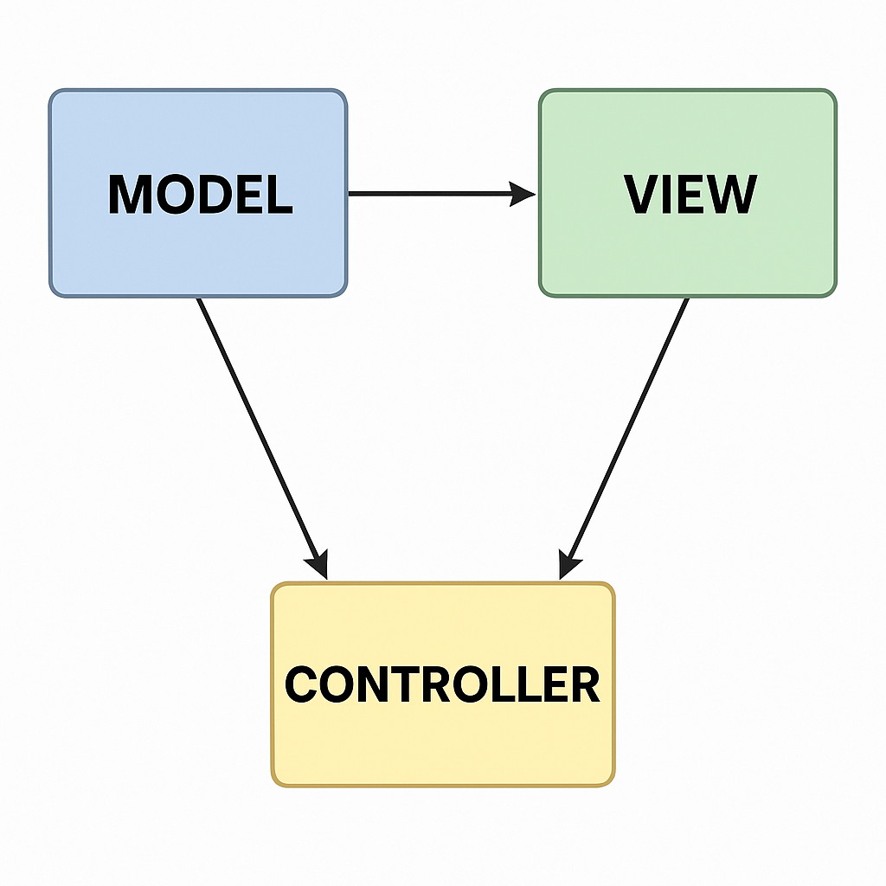

# Laporan Modul 1: Perkenalan Laravel
**Mata Kuliah:** Workshop Web Lanjut   
**Nama:** [Khalisha Zafira]  
**NIM:** [2024573010040]  
**Kelas:** [TI 2C]  

---

## Abstrak 
Tuliskan ringkasan singkat tentang isi laporan ini dan tujuan Anda membuat laporan.

[laporan ini memuat langkah-langkah praktikum instalasi Laravel dan persiapan lingkungan kerja, termasuk verifikasi tools, pembuatan repositori GitHub, struktur folder proyek, serta pembuatan dan konfigurasi project Laravel pertama dengan koneksi ke database MySQL, adapun tujuan nya ialah untuk memberikan dokumentasi awal pembelajaran tentang Laravel, mencakup pemahaman dasar, instalasi, serta praktik pembuatan dan konfigurasi project Laravel pertama.]

---

## 1. Pendahuluan
- Tuliskan teori perkenalan tentang laravel
  [Laravel adalah salah satu framework PHP modern yang dirancang untuk mempermudah proses pengembangan aplikasi web dengan menyediakan berbagai fitur bawaan dan pendekatan pengkodean yang elegan. Framework ini dibuat untuk meningkatkan produktivitas dan efisiensi pengembang dalam menulis kode yang bersih, terstruktur, dan mudah dipelihara. Laravel mengadopsi berbagai prinsip dari pemrograman modern, seperti MVC (Model-View-Controller), dependency injection, ORM (Object-Relational Mapping), serta sistem routing yang fleksibel. Laravel juga mendorong penggunaan konvensi dibanding konfigurasi, artinya pengembang bisa langsung mulai membangun aplikasi tanpa harus mengatur banyak hal dari nol.]

- Apa itu Laravel?
  [Laravel adalah framework web berbasis PHP yang bersifat open-source dan dirancang untuk membangun aplikasi web modern dengan cara yang efisien, aman, dan elegan. Laravel dirancang untuk menghilangkan "kerumitan" yang biasa ditemui dalam pengembangan aplikasi PHP murni, dengan menyediakan struktur dan alat bantu yang lengkap. Dengan Laravel, pengembang tidak perlu membangun semua fitur dari awal — cukup mengikuti alur dan struktur yang telah disediakan oleh framework.]

- Karakteristik utama (MVC, opinionated, dsb.)
  [-Arsitektur MVC (Model-View-Controller):
  Laravel menggunakan pola MVC untuk memisahkan antara data, tampilan, dan logika aplikasi, yang mempermudah pengelolaan kode.

 -Opinionated Framework:
  Laravel membawa serangkaian aturan, struktur, dan best practice yang disarankan untuk diikuti, sehingga memudahkan pengembangan yang konsisten dan terstandarisasi.

 -Sintaks yang Bersih dan Ekspresif:
  Laravel menawarkan sintaks yang ramah dan mudah dibaca, yang membuat proses pengembangan menjadi lebih cepat dan menyenangkan.

 -Ekosistem yang Lengkap:
  Laravel dilengkapi dengan berbagai alat dan pustaka bawaan seperti Eloquent ORM, Blade Templating, Artisan CLI, dan sistem validasi input yang terintegrasi.]

- Untuk jenis aplikasi apa Laravel cocok?
  [Laravel cocok digunakan untuk membangun berbagai jenis aplikasi web, antara lain:

  Website dan blog pribadi, Aplikasi bisnis berskala kecil hingga besar, Sistem e-commerce, Sistem manajemen konten (CMS)
  Dashboard dan aplikasi admin, RESTful API backend untuk mobile app, Aplikasi internal perusahaan seperti sistem kepegawaian, inventaris, dan lainnya]

---

## 2. Komponen Utama Laravel (ringkas)
Tuliskan penjelasan singkat (1–3 kalimat) untuk tiap komponen berikut:
- Blade (templating)
  [Blade adalah sistem templating Laravel yang digunakan untuk membuat tampilan dinamis dengan sintaks yang sederhana dan bersih.]

- Eloquent (ORM)
  [Eloquent adalah ORM Laravel yang mempermudah interaksi dengan basis data menggunakan model tanpa perlu menulis SQL mentah.]

- Routing
  [Routing mengatur arah permintaan URL ke fungsi atau controller yang sesuai dalam aplikasi.]

- Controllers
  [Controller menangani logika aplikasi dan menjadi penghubung antara model dan view.]

- Migrations & Seeders
  [Migration digunakan untuk mengelola struktur database, sedangkan seeder digunakan untuk mengisi data awal atau data uji.]

- Artisan CLI
  [Artisan adalah command-line tool Laravel untuk menjalankan perintah seperti membuat file, menjalankan migrasi, atau memulai server.]

- Testing (PHPUnit)
  [Laravel mendukung pengujian otomatis dengan PHPUnit untuk memastikan aplikasi berjalan sesuai harapan.]

(Tambahkan komponen lain jika ingin)

---

## 3. Berikan penjelasan untuk setiap folder dan files yang ada didalam struktur sebuah project laravel.
  [1. app/

  Berisi semua kode inti aplikasi, termasuk model, controller, middleware, dan logika bisnis lainnya.

  Http/: Tempat controller, middleware, dan request handler berada.

  Models/: Tempat penyimpanan model Eloquent (biasanya digunakan untuk mewakili tabel database).

  2. bootstrap/

  Berisi file bootstrap yang diperlukan Laravel saat pertama kali dijalankan.

  app.php: File utama untuk menginisialisasi framework.

  cache/: Menyimpan file cache bootstrap agar aplikasi berjalan lebih cepat.

  3. config/

  Berisi semua file konfigurasi aplikasi seperti database, mail, cache, session, dan lainnya.

  4. database/

  Berisi file yang berkaitan dengan database.

  migrations/: File untuk mendefinisikan struktur tabel database.

  seeders/: Untuk mengisi data awal (dummy/test) ke database.

  factories/: Untuk membuat data uji menggunakan model factory.

  5. public/

  Folder ini adalah root direktori web server. Berisi file index.php, gambar, CSS, JavaScript, dan hasil build front-end.

  6. resources/

  Berisi file yang berkaitan dengan tampilan dan aset aplikasi.

  views/: Berisi file Blade (template HTML).

  css/, js/: Tempat untuk menyimpan file CSS dan JavaScript mentah.

  lang/: File terjemahan bahasa (lokalisasi).

  7. routes/

  Berisi file untuk mendefinisikan routing aplikasi.

  web.php: Routing untuk aplikasi berbasis web.

  api.php: Routing untuk API.

  console.php: Routing untuk perintah Artisan CLI.

  channels.php: Routing untuk broadcasting (event real-time).

  8. storage/

  Digunakan untuk menyimpan file sementara seperti log, cache, file upload, dan compiled views.

  logs/: File log aplikasi.

  framework/: Cache, sesi, dan view yang sudah dikompilasi.

  9. tests/

  Berisi file untuk pengujian aplikasi.
  Feature/: Pengujian fitur aplikasi.
  Unit/: Pengujian unit (bagian kecil dari kode).

  10. vendor/

  Berisi semua dependensi atau paket yang diinstal melalui Composer. Jangan ubah isi folder ini secara manual.

  11. File Penting di Root Project:

  - .env: File konfigurasi environment (database, mail, dsb).

  - artisan: Command-line interface Laravel.

  - composer.json: File konfigurasi untuk dependensi PHP.

  - package.json: File konfigurasi untuk dependensi front-end (Node.js).

  - webpack.mix.js: Konfigurasi untuk kompilasi aset front-end.

  - README.md: Dokumentasi atau deskripsi proyek.

  - server.php: Untuk menjalankan server built-in Laravel (jarang digunakan karena digantikan oleh php artisan serve).]
---

## 4. Diagram MVC dan Cara kerjanya

Cara kerja MVC (Model–View–Controller)

- User berinteraksi dengan aplikasi melalui View

- View mengirim permintaan ke Controller

- Controller menerima input dari View dan memprosesnya.

- Controller menghubungi Model

- Model mengembalikan data ke Controller

- Controller mengirim data ke View

- View menampilkan hasil ke user

- Tampilan (UI) diperbarui sesuai data terbaru.

---

## 6. Kelebihan & Kekurangan (refleksi singkat)
- Kelebihan Laravel menurut Anda
  [ Memiliki struktur kode yang rapi dan terorganisir (MVC),  sehingga memudahkan dalam pengembangan aplikasi.

    Dokumentasi sangat lengkap dan komunitas besar, jadi mudah menemukan solusi ketika ada masalah.

    Fitur bawaan yang kaya seperti authentication, routing, Eloquent ORM, dan Blade template engine.

    Mendukung keamanan aplikasi dengan fitur CSRF protection, enkripsi, dan sanitasi input.]

- Hal yang mungkin menjadi tantangan bagi pemula
  [Membutuhkan pemahaman dasar PHP OOP sebelum benar-benar nyaman menggunakan Laravel.

  Instalasi dan konfigurasi awal (Composer, environment, dependency) bisa membingungkan bagi yang baru belajar.

  Banyaknya fitur bisa terasa “overwhelming” bagi pemula karena harus mempelajari banyak konsep baru.]

---

## 7. Referensi
Cantumkan sumber yang Anda baca (buku, artikel, dokumentasi) — minimal 2 sumber. Gunakan format sederhana (judul — URL).
  [Dokumentasi Resmi Laravel — https://laravel.com/docs

   W. Widada, Pemrograman Web dengan Laravel — https://repository.penerbitwidina.com/

   Tutorial Laravel di W3Schools — https://www.w3schools.com/laravel]

---