# Laporan Modul 2: Laravel Fundamentasl
**Mata Kuliah:** Workshop Web Lanjut   
**Nama:** [Khalisha Zafira]  
**NIM:** [2024573010040]  
**Kelas:** [TI_2C]  

---

## Abstrak 
Tuliskan ringkasan singkat tentang isi laporan ini dan tujuan Anda membuat laporan.
[ Laporan ini berisi penjelasan mengenai pembuatan aplikasi kalkulator sederhana menggunakan 
  framework Laravel. Dalam aplikasi ini, user dapat melakukan operasi aritmatika dasar seperti 
  penjumlahan, pengurangan, perkalian, dan pembagian. Proses perhitungan dilakukan melalui alur 
  Route → Controller → View, sedangkan hasilnya ditampilkan pada halaman antarmuka berbasis Blade.
  Validasi input juga diterapkan untuk memastikan data yang dimasukkan sesuai, misalnya mencegah 
  kesalahan seperti pembagian dengan nol.

  Tujuan Pembuatan Laporan
  Tujuan dari laporan ini adalah:
  - Mendokumentasikan proses pembuatan aplikasi kalkulator sederhana.
  - Menunjukkan bagaimana Laravel menangani request, response, validasi input, 
    serta pengolahan data.
  - Memberikan gambaran penerapan konsep dasar MVC (Model-View-Controller) dalam 
    sebuah program sederhana.]
---

## 1. Dasar Teori
- Apa itu MVC (Model, View, Controller).
  [ MVC adalah singkatan dari Model-View-Controller, sebuah pola arsitektur
  perangkat lunak yang digunakan untuk memisahkan concern dalam aplikasi web
  
  Model: Merepresentasikan data dan logika bisnis. Dalam Laravel, biasanya
  ditangani oleh Eloquent models yang berinteraksi dengan database
  
  View: Menangani lapisan presentasi- yaitu HTML yang ditampilkan kepada pengguna.
  Laravel menggunakan Blade sebagai templatr engine untuk view
  
  Controller: Mengatur alur anatar model dan view. Controller menerima input dari
  pengguna (melalui route) memprosesnya (seringkali melibatkan model),dan mengembalikan
  view atau respons yang sesuai]

- Konsep Routing di Laravel.
  [ Routing di Laravel mendefinisikan bagaimana aplikasi merespons permintaan yang masuk.
    Routing memetakan URI ke aksi controller atau closure.Route di Laravel didefinisikan 
    di file routes/web.php]

- Fungsi Middleware.
  [ Middleware berfungsi sebagai perantara antara request dan response. Dia bisa memeriksa,
   memfilter, atau memodifikasi request sebelum masuk ke controller, dan juga response 
   sebelum dikirim ke user (contoh: autentikasi, logging, CSRF protection). ]

- Bagaimana cara Laravel menangani Request dan Response.
  [ - Request dari user masuk ke public/index.php.
    - Lalu diteruskan ke Kernel, di situ dijalankan middleware.
    - Setelah lolos middleware, request diarahkan ke route → controller → logic aplikasi.
    - Hasil dari controller dikembalikan sebagai response yang bisa berupa HTML, JSON, dll,  
      lalu dikirim ke  browser.]

- Peran Controller dan View.
  [ Controller: mengatur logika aplikasi, menerima request, memproses data 
    (misalnya lewat model), lalu menentukan apa yang harus ditampilkan.
    
    View: menampilkan data dalam bentuk antarmuka (UI) untuk user, biasanya berisi 
    HTML + Blade syntax. ]

- Fungsi Blade Templating Engine.
  [ Blade memudahkan pembuatan view di Laravel dengan:
    - Mendukung template inheritance (layout dasar bisa diwarisi).
    - Sintaks sederhana (@if, @foreach, dll).
    - Bisa menyisipkan variabel PHP dengan aman.→ Intinya mempermudah pemisahan 
      logika dan tampilan.]
---

## 2. Langkah-Langkah Praktikum
Tuliskan langkah-langkah yang sudah dilakukan, sertakan potongan kode dan screenshot hasil.

2.1 Praktikum 1 – Route, Controller, dan Blade View

- Tambahkan route pada routes/web.php.
  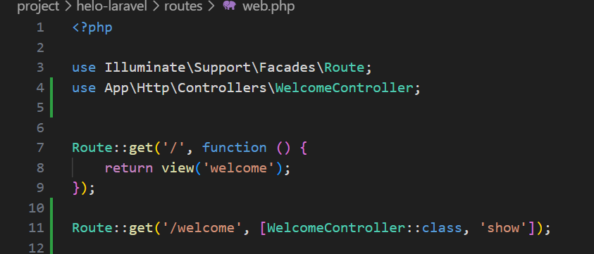

- Buat controller WelcomeController.
  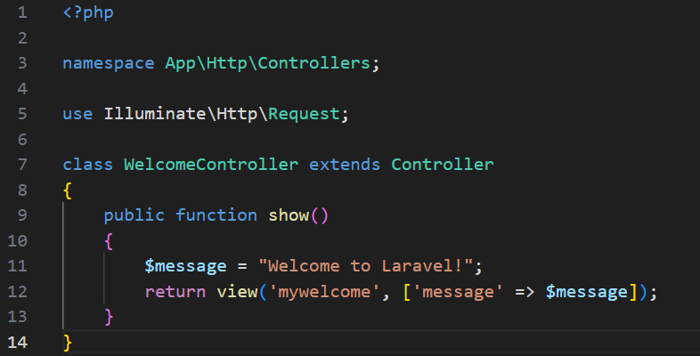

- Buat view mywelcome.blade.php.
  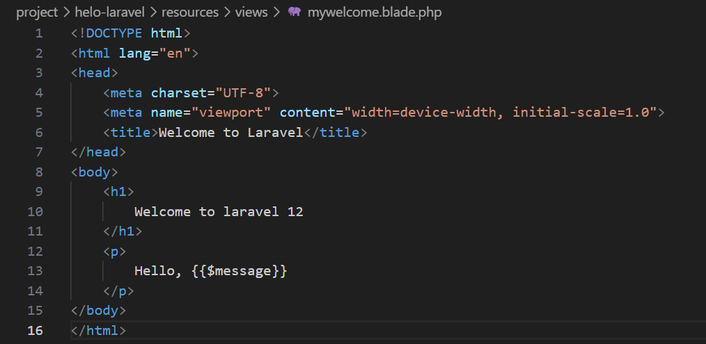
- Jalankan aplikasi dan tunjukkan hasil di browser.

Screenshot Hasil:
  

2.2 Praktikum 2 – Membuat Aplikasi Sederhana "Calculator"

- Tambahkan route untuk kalkulator.
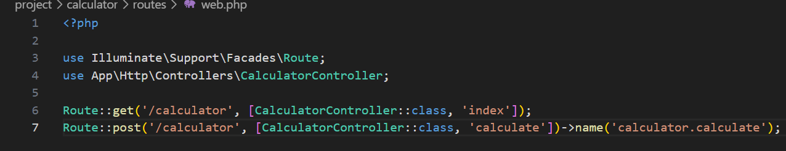

- Buat controller CalculatorController.
  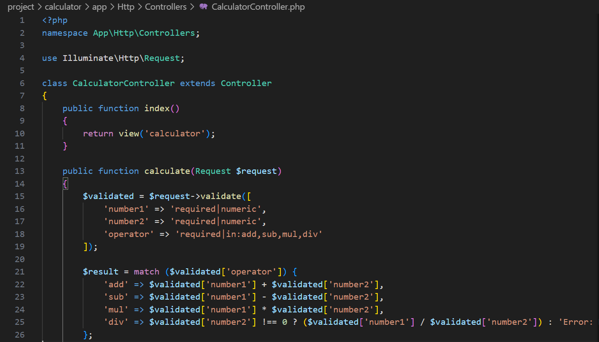
  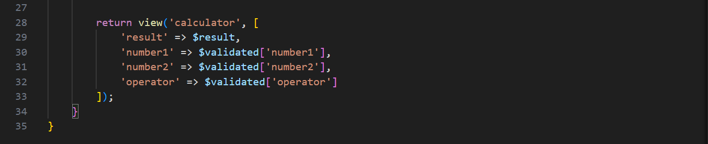

- Tambahkan view calculator.blade.php.
  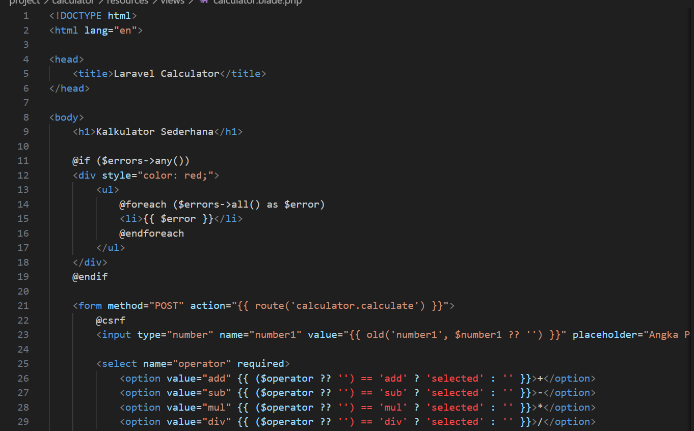
  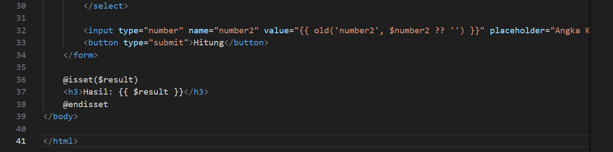

- Jalankan aplikasi dan coba dengan beberapa input berbeda.
Screenshot Hasil:
  - Calculator Penambahan:
    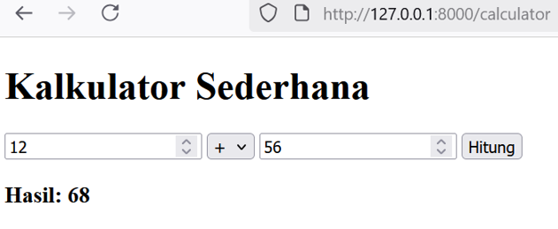

  - Calculator Pengurangan:
    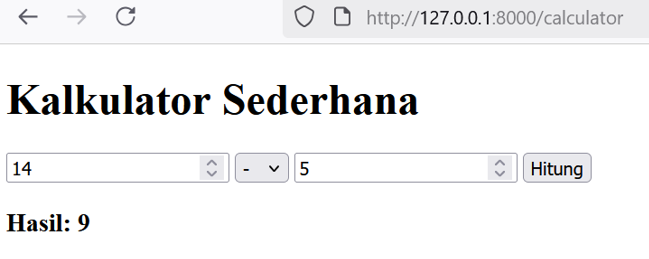

  - Calculator Perkalian:
    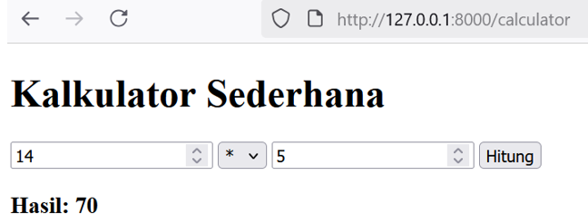

  - Calculator Pembagian:
    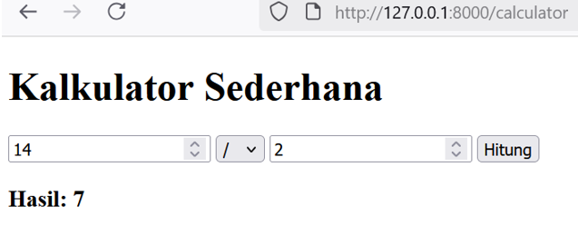
---

## 3. Hasil dan Pembahasan
Jelaskan apa hasil dari praktikum yang dilakukan.
- Apakah aplikasi berjalan sesuai harapan?
  [ Aplikasi berjalan sesuai harapan jika alur Route → Controller → View sudah benar, logika 
   di Controller sesuai kebutuhan, dan data dari user divalidasi dengan benar sebelum diproses.

    Laravel sendiri membantu memastikan alur ini konsisten dengan sistem routing, 
    middleware, validasi, dan Blade untuk tampilan.]

- Apa yang terjadi jika ada input yang salah (misalnya pembagian dengan 0)?
  [ Kalau tidak ada validasi atau error handling, maka program akan menghasilkan
    error / exception (contoh: Division by zero error).

    Laravel punya exception handler, jadi error biasanya ditampilkan dalam 
    bentuk halaman error (di mode development) atau pesan generik (di mode production)]

- Bagaimana validasi input bekerja di Laravel?
  [ Laravel punya sistem Validator untuk memastikan data yang masuk sesuai aturan.
    Validasi bisa dilakukan:
    Langsung di Controller dengan $request->validate([...]).
    Atau menggunakan Form Request Class khusus.Jika input tidak valid → otomatis 
    redirect kembali dengan pesan error.Jika valid → data diteruskan ke proses 
    selanjutnya (misalnya simpan ke database).]

- Apa peran masing-masing komponen (Route, Controller, View) dalam program yang dibuat?
  [- Route:
     Menentukan URL mana yang akan memanggil controller atau action tertentu.
     → ibarat peta jalan dari request ke logic.

     Controller:
     Mengatur logika aplikasi: menerima request dari Route, mengolah data 
     (bisa lewat Model), lalu menentukan View atau Response apa yang diberikan ke user.

     View:
     Bertugas menampilkan hasil ke user, biasanya berupa HTML + Blade.
     → Jadi user hanya melihat tampilan, tanpa tahu logika di belakangnya.]
---

## 4. Kesimpulan

Tulis kesimpulan dari praktikum ini
[ Dari praktikum ini dapat disimpulkan bahwa framework Laravel mampu mempermudah 
  pembuatan aplikasi    berbasis web dengan konsep MVC (Model-View-Controller). Penerapan Route, Controller, dan View membuat alur program menjadi lebih terstruktur, sedangkan penggunaan Blade templating engine membantu dalam penyusunan tampilan.

  Selain itu, penerapan validasi input sangat penting untuk mencegah error, seperti kasus pembagian
  dengan nol. Melalui praktikum kalkulator sederhana ini, pemahaman mengenai cara Laravel menangani request, response, serta error handling dapat diperoleh dengan lebih nyata dan aplikatif.]

---

## 5. Referensi
Cantumkan sumber yang Anda baca (buku, artikel, dokumentasi) — minimal 2 sumber. Gunakan format sederhana (judul — URL).
[ Laravel Documentation — Validation
https://laravel.com/docs/10.x/validation

Laravel Documentation — Routing
https://laravel.com/docs/10.x/routing

Welling, J. & Thomson, L. — PHP and MySQL Web Development (5th Edition)]

---